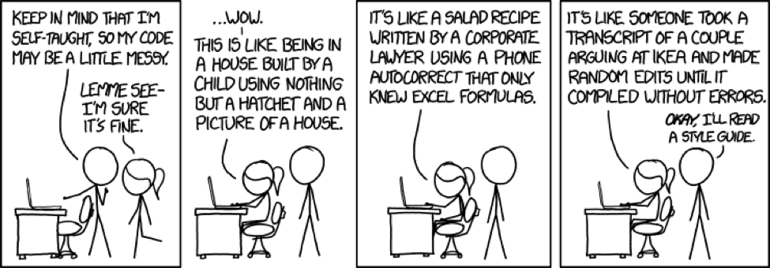

# Coding Standards

## GitFlow

### What Is GitFlow

GitFlow is a Git workflow design, created and made popular by Vincent Driessen, at [NVIE](https://nvie.com/posts/a-successful-git-branching-model/). It has attracted a lot of attention because it is very well suited to collaboration and scaling the development team, by offering a strong versionning method to a Git repository.


### Master Branch

The master branch only stores the official release history of the software. 
The master branch is frozen and commit is forbidden.
However, all commit produced by a merge should be tagged by a version number, that only increases, never decreases.

To develop, use the develop branch along with a feature branch related to the feature.

If the change should quickly affect the master branch, for example in case of important hotfixes, please use the hotfixes branch described below.

### Develop & Feature Branches

The develop branch is frozen and no commit should be directly pushed to it.
To develop a feature, create a feature branch.
For example if you want to develop a *authentication* feature, create a branch named *feature/authentication* from develop.
```bash
git checkout develop
git checkout -b feature/authentication
# push empty branch to create it on remote
git push -u origin feature/authentication
# work, commit and push
git commit
git push -u origin feature/authentication
```
Once the feature is completed, create a Pull Request through Github ([documentation here](https://help.github.com/en/github/collaborating-with-issues-and-pull-requests/creating-a-pull-request)), from your feature branch to the develop branch, and wait for it to be reviewed and accepted.
If rejected, please ensure to fix all necessary changes.
If accepted, please merge it by yourself.

If the develop branch does not exist yet:
```bash
git checkout master
git checkout -b develop
git push -u origin develop
```

### Hotfixes Branch

If an important issue in master needs to be quickly fixed, use the hotfixes branch.


```bash
git checkout master
git checkout -b hotfix-...
# work, commit and push
git commit
git push -u origin hotfix-...
```

Once the hotfix is completed, create two Pull Requests through Github ([documentation here](https://help.github.com/en/github/collaborating-with-issues-and-pull-requests/creating-a-pull-request)), from the hotfix branch to the develop & master branches, and wait for them to be reviewed and accepted.
If rejected, please ensure to fix all necessary changes.
If accepted, please merge it by yourself.

Do not forget to tag your merge on the master branch with a increased version number.

### Release Branches

Prior a release, a branch should be created from develop, named `release/v...`.
Only bug fixes should be committed to this branch.
All commits should be merged back to the develop branch.

```bash
git checkout develop
git checkout -b release/v2.0
# work, commit and push
git commit
git push -u origin release/v2.0
```

Once the release is completed, create one Pull Requests through Github ([documentation here](https://help.github.com/en/github/collaborating-with-issues-and-pull-requests/creating-a-pull-request)), from the release branch to the master branch, and wait for it to be reviewed and accepted.
If rejected, please ensure to fix all necessary changes.
If accepted, please merge it by yourself.

Do not forget to tag your merge on the master branch with the corresponding version number from the release branch name.

### Summary

- A develop branch is created from master
- Release branches are created from develop
- Feature branches are created from develop
- When a feature is completed it is merged into the develop branch through a Pull Request
- When a release branch is completed it is merged into develop and master through Pull Requests
- If an issue in master is detected a hotfix branch is created from master
- Once the hotfix is complete it is merged to both develop and master

## Commit Messages

Commit messages are essential to be able to retrace changes through the Git history.

Here are 5 important points:
- Separate subject from body with a blank line
- Limit the subject line to 50 characters
- Do not end the subject line with a period
- Use the imperative mood in the subject line
- Use the body to explain what and why

## Code Cleanliness

Please use a automated code linter, linked to your IDE, in order to make the work easier for you.

Here are our linters we use:
- Python - [pylint](https://www.pylint.org/)
- JavaScript - [eslint](https://eslint.org/)
- Java - [checkstyle](https://checkstyle.org/)
- Golang - [gofmt](https://blog.golang.org/gofmt)
- Shell - [shellcheck](https://www.shellcheck.net/)



1. Naming Standards

Respect the standards for each coding languages.

2. Revise Your Logic

Use diagrams before coding.

3. Avoid Large Functions

Instead of repeating code break it out into a function and keep functions to only one job.

4. Use Proper Indentation

Use your linter indentation.

5. Use Explanatory Comments

Leaving good comments behind can really help your teammates or future developers understand what the code does.

6. Don’t Overuse Comments

Keep your comments clean, straightforward and to the point. Comments are not made for writing explanatory notes to self (/*I will finish this later*/), blaming others (/*Joe did this…*/), or erasing code.

7. Delete Old or Unused Code

Do not hide old code in comments, remove it. It will still be living in the Git history.

## Contribution

Please contribute by following the GitFlow method described above.

## References

* A Successful Branching Model - https://nvie.com/posts/a-successful-git-branching-model/
* How To Write A Commit Message - https://chris.beams.io/posts/git-commit/
* Tips For Code Cleanliness
