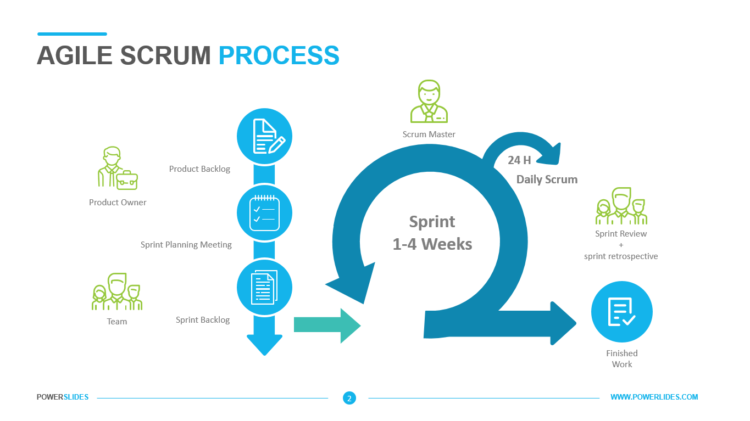

# Task estimation

Depending on the methodology used, the approach to defining a task is not necessarily identical. In our situation, we will use the Agile Scrum methodology.

This methodology requires that the different tasks are organized as a hierarchical tree, with at the top is the project, a first level composed of the epics that represents a major functionality of the project, to which are attached a multitude of smaller tasks.  It is the cumulative estimation of these small tasks that will give an overall view of the estimated time it will take to develop this functionality.
In order to refine this estimate, it is then necessary to construct a Gantt chart, with some tasks being able to be carried out in parallel with others, and on the contrary, some tasks requiring that progress has already been made beforehand to be carried out.
This diagram will finally provide more detailed information on the overall time that the functionality should take to complete, and by extension, the total of all the estimates of the epics will allow to know the estimated time of completion for the entire project.

## Break out Big Tasks

One of the important points is to correctly break down the functionality into small tasks. The smaller a task is, the easier it is possible to have a clear view of the working time it requires. On the other hand, the larger a task is and/or the less it is defined and limited, the more risky it will be to make an estimate, as complications or misinterpretations may arise, thus accumulating the technical debt that will have to be corrected later in the project, distorting the estimate made in the first place.

## Ask the expert

It is crucial to involve the team that will be in charge of development in the estimation of the most specific tasks. Firstly, the manager cannot know everything about everything, and the opinion of the staff who will be in charge of the task can help to obtain a more accurate estimate of the task. Second, staff may not be comfortable with all the technologies they will be working on. If the manager overestimates the capabilities of his staff on certain tasks, once again the estimate can be wrong if it does not take into account the training time that it will be necessary to take to complete the task. Finally, in the absence of a precise knowledge of the subject matter of the task, the manager may be led to edit a task that could, with the contribution of the expertise of his team, have been divided into smaller tasks.

## Experience

An estimate is to be considered for what it is: an estimate. In most cases, it will turn out to be at best slightly inaccurate, in the worst case completely wrong. This is by no means a problem, since this estimate is only there as an indication, to try to determine whether the project is progressing correctly or not. In the event of a problem, a significant delay may allow the team to react and take the necessary measures to correct the problem (change of processes, modification of technical choices, etc.). On the other hand, it is important to consider the experience accumulated on previous projects and estimates to refine future estimates and improve the structure and processes to optimize the team's future work. In addition, taking into account the tasks performed in the past to build the schedule and assigning tasks to the most competent staff on each task can improve the production speed of the team.

## Conclusion

The time estimate is a powerful tool in the process of planning and realization of a project, both for the development team and for the managers. For the former, it allows them to better plan their work, by having visibility on how long a task should take, and to quickly escalate a problem if a task takes longer than expected to complete, which often results from a problem that must then be corrected to improve future work as well as the project itself. For managers, this allows them to have a better medium-term visibility, to monitor the project, to ensure that deadlines are met and to be able to effectively inform management on the status of the project. Finally, it allows them to optimize the task schedule according to fluctuations in the availability of personnel and resources.

## References

* Learn Task Estimation Secrets - https://levelup.gitconnected.com/learn-task-estimation-secrets-644e8cbca89e?gi=2dc7243dd0cd
* An Expert View On Test Estimation - https://www.guru99.com/an-expert-view-on-test-estimation.html
* Guide To Project Management - https://www.teamgantt.com/guide-to-project-management/how-to-estimate-projects
* Tips For Task Estimating - https://www.projectmanager.com/blog/5-tips-for-task-estimating
* Story Point And Estimation - https://www.atlassian.com/agile/project-management/estimation
