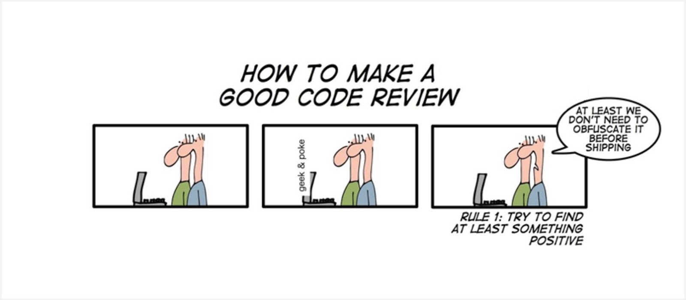

# Code Review

Code review is a review of the source code of a project. The overall goal is to find bugs, potential vulnerabilities, to correct design errors or to have a good readability of the code. All this with the aim of improving the quality, maintainability and security of the project.
The objectives of the code review are :
- Improve code quality
- Encouraging collaboration, teamwork and teamwork
- Apply a code standard
- Detecting and correcting faults in each push

### When to do a code review:
    You can do a code review every push if you feel the need. However, on minor pushs, this can be a waste of time. That's why it's better to do a code review when you add a feature to the project or when the push modifies code already in the project. This will allow you to make sure that the work you are going to share does not jeopardize what has already been done. Of course, a general code review will have to be done at each big step, for example before merging work on the production, pre-production or master branches.

### Making a code review easier:
    - Before submitting a code review, please make sure that the code is working properly. You can either test it on your own or set up an automatic testing system.
    - Make sure you don't submit too much code at once. This makes the code review more complex for the person looking at your code. Avoid submitting more than 400 lines.
    - In order to allow as little time as possible for code reviews, it would be helpful to be explicit in your commit messages. For example, when you add a feature, please specify in which folder it is located, its name, and its purpose. This will allow the person doing the code review to better understand what you have done.

### During the code review :
    - You have just received a code review request. Finish your current task and the next task should be the code review. The person who requested the review may be waiting for you to continue working.
    - As the person who is going to review the work, you should pay attention to different things. Does the code respond well to a specific task (bug fixes, code rewriting, new features). Is the code functional, if so, is it slow to run? Can it be optimized or not? Is it easily understandable, if you take too much time to understand how it works, it is not good for the maintainability of the project. In the same idea, is the code standard well respected? The code standard is very helpful for the maintainability of the project.
    - Be careful, don't spend too much time on a code review, it is rarely necessary to spend more than 30min on it. If you spend more than an hour, there is a problem in the code you are reviewing.

### After the code review:
    - In case you validate the code review, just put a message that you have understood the code by quickly summarizing the code.
    - In case you refuse the code review, remain polite and courteous. Start writing a summary of why you are refusing the code review first. Whether it is because of the code standard, a run-time error, or something else. Then, put comments in the code to help the developer in his future work. That way you tell him exactly where it's not, but also why there's a problem. This will save him a lot of time.
    - If you feel the need, don't hesitate to go and meet the person who submitted the code review in order to help him as much as possible in his task.

### Conclusion:
You now know how to act in the case of a code review, whether you are the one submitting the code or the one checking it. Keep in mind that this is a team effort and the goal is to waste as little time as possible in general. So be explicit about your commits or code review messages. Stay polite and patient for the good of all.

***

Source :
* >https://medium.com/palantir/code-review-best-practices-19e02780015f
* >https://www.perforce.com/blog/qac/9-best-practices-for-code-review
* >https://stackoverflow.blog/2019/09/30/how-to-make-good-code-reviews-better/
* >https://www.ibm.com/developerworks/rational/library/11-proven-practices-for-peer-review/
* >https://en.wikipedia.org/wiki/Code_review

